# ModLaNets

**Yupu Lu, Shijie Lin, Guanqi Chen, Jia Pan**

- Paper: [ModLaNets: Learning Generalisable Dynamics via Modularity and Physical Inductive Bias](https://arxiv.org/abs/2206.12325)

Deep learning models are able to approximate one specific dynamical system but struggle at learning generalisable dynamics, where dynamical systems obey the same laws of physics but contain different numbers of elements (e.g., double- and triple-pendulum systems). To relieve this issue, we proposed the Modular Lagrangian Network (ModLaNet), a structural neural network framework with modularity and physical inductive bias. 

This framework models the energy of each element using modularity and then construct the target dynamical system via Lagrangian mechanics. Modularity is beneficial for reusing trained networks and reducing the scale of networks and datasets. As a result, our framework can learn from the dynamics of simpler systems and extend to more complex ones, which is not feasible using other relevant physics-informed neural networks. 

We examine our framework for modelling double-pendulum or three-body systems with small training datasets, where our models achieve the best data efficiency and accuracy performance compared with counterparts. We also reorganise our models as extensions to model multi-pendulum and multi-body systems, demonstrating the intriguing reusable feature of our framework.


**Cite**

If you find our project helpful, please cite our work:

```

@InProceedings{pmlr-v162-lu22c,
  title = 	 {{M}od{L}a{N}ets: Learning Generalisable Dynamics via Modularity and Physical Inductive Bias},
  author =       {Lu, Yupu and Lin, Shijie and Chen, Guanqi and Pan, Jia},
  booktitle = 	 {Proceedings of the 39th International Conference on Machine Learning},
  pages = 	 {14384--14397},
  year = 	 {2022},
  editor = 	 {Chaudhuri, Kamalika and Jegelka, Stefanie and Song, Le and Szepesvari, Csaba and Niu, Gang and Sabato, Sivan},
  volume = 	 {162},
  series = 	 {Proceedings of Machine Learning Research},
  month = 	 {17--23 Jul},
  publisher =    {PMLR},
  pdf = 	 {https://proceedings.mlr.press/v162/lu22c/lu22c.pdf},
  url = 	 {https://proceedings.mlr.press/v162/lu22c.html},
}
```


## Usage

```
usage: train.py [-h] [--model MODEL] [--use_rk4] [--obj OBJ] [--dof DOF]
                [--dim DIM] [--learn_rate LEARN_RATE]
                [--hidden_dim HIDDEN_DIM] [--nonlinearity NONLINEARITY]
                [--field_type FIELD_TYPE]
                [--energy_hidden_dim ENERGY_HIDDEN_DIM]
                [--energy_nonlinearity ENERGY_NONLINEARITY]
                [--trans_hidden_dim TRANS_HIDDEN_DIM]
                [--trans_nonlinearity TRANS_NONLINEARITY] [--gpu [GPU]]
                [--overwrite [OVERWRITE]] [--load_obj LOAD_OBJ]
                [--load_epoch LOAD_EPOCH] [--end_epoch END_EPOCH]
                [--use_lr_scheduler USE_LR_SCHEDULER] [--samples SAMPLES]
                [--noise NOISE] [--save_dir SAVE_DIR] [--name NAME] [--plot]
                [--verbose] [--print_every PRINT_EVERY] [--seed SEED]

optional arguments:
  -h, --help            show this help message and exit
  --model MODEL         Select model to train, either 'modlanet', 'lnn',
                        'hnn', or 'baseline' currently
  --use_rk4             integrate derivative with RK4
  --obj OBJ             number of elements
  --dof DOF             degree of freedom
  --dim DIM             space dimension, 2D or 3D
  --learn_rate          learning rate
  --hidden_dim          hidden dimension of mlp
  --nonlinearity        neural net nonlinearity
  --field_type          type of vector field to learn
  --energy_hidden_dim   hidden dimension of mlp for engergies
  --energy_nonlinearity neural net nonlinearity for engergies
  --trans_hidden_dim    hidden dimension of mlp for transformations
  --trans_nonlinearity  neural net nonlinearity for transformations
  --gpu [GPU]           try to use gpu?
  --overwrite           overwrite the saved model.
  --load_obj LOAD_OBJ   load saved model for the corresponding system, only
                        works for ModLaNet.
  --load_epoch          load saved model at steps k.
  --end_epoch           end of training epoch
  --use_lr_scheduler    whether to use lr_scheduler.
  --samples SAMPLES     the number of sampling trajectories
  --noise NOISE         the noise amplitude of the data
  --save_dir SAVE_DIR   where to save the trained model
  --name NAME           only one option right now
  --plot                plot training and testing loss?
  --verbose             verbose?
  --print_every         number of gradient steps between prints
  --seed SEED           random seed
```


## Experiments

### Part 1: Training

#### 1. Settings

To train a Modular Lagrangian Neural Network (ModLaNet) or other models.

Setting is as follows.

- Case 1: Double pendulum systems: 

| Network        | Execution                                                    |
| -------------- | ------------------------------------------------------------ |
| ModLaNet       | `python ./experiment-pend-2+/train.py --model 'modlanet' --learn_rate 1e-2 --end_epoch 10000 --overwrite --verbose --plot` |
| Light Baseline | `python ./experiment-pend-2+/train.py --model 'baseline' --hidden_dim 75 --learn_rate 1e-2 --end_epoch 10000 --overwrite --verbose --plot` |
| Light HNN      | `python ./experiment-pend-2+/train.py --model 'hnn' --hidden_dim 75 --learn_rate 1e-2 --end_epoch 10000 --overwrite --verbose --plot	` |
| Light LNN      | `python ./experiment-pend-2+/train.py --model 'lnn' --hidden_dim 75 --learn_rate 1e-3 --end_epoch 10000 --overwrite --verbose --plot --gpu` |
| Baseline       | `python ./experiment-body-3+/train.py --model 'baseline' --learn_rate 1e-3 --end_epoch 3000 --overwrite --verbose --plot` |
| HNN            | `python ./experiment-pend-2+/train.py --model 'hnn' --learn_rate 1e-2 --end_epoch 10000 --overwrite --verbose --plot` |
| LNN            | `python ./experiment-pend-2+/train.py --model 'lnn' --learn_rate 1e-3 --end_epoch 10000 --overwrite --verbose --plot --gpu --hidden_dim 600 ` |

- Case 2: Three-body systems: 

| Network        | Execution                                                    |
| -------------- | ------------------------------------------------------------ |
| ModLaNet       | `python ./experiment-body-3+/train.py --model 'modlanet' --learn_rate 1e-3 --end_epoch 3000 --overwrite --verbose --plot` |
| Light Baseline | `python ./experiment-body-3+/train.py --model 'baseline' --learn_rate 1e-3 --end_epoch 3000 --overwrite --verbose --plot --hidden_dim 70 ` |
| Light LNN      | `python ./experiment-body-3+/train.py --model 'lnn' --learn_rate 1e-3 --end_epoch 3000 --overwrite --verbose --plot --gpu --hidden_dim 70 ` |
| Light HNN      | `python ./experiment-body-3+/train.py --model 'hnn' --learn_rate 1e-3 --end_epoch 3000 --overwrite --verbose --plot --hidden_dim 70 ` |
| Baseline       | `python ./experiment-body-3+/train.py --model 'baseline' --learn_rate 1e-3 --end_epoch 3000 --overwrite --verbose --plot` |
| HNN            | `python ./experiment-body-3+/train.py --model 'hnn' --learn_rate 1e-3 --end_epoch 3000 --overwrite --verbose --plot` |
| LNN            | `python ./experiment-body-3+/train.py --model 'lnn' --learn_rate 1e-3 --end_epoch 3000 --overwrite --verbose --plot --gpu --hidden_dim 600` |


#### 2. Training Results

- Task 1: Double pendulum systems: 

| Network  | Number of parameters | Training Figure                                              | Loss                                                         |
| -------- | ------------ | ------------------------------------------------------------ | ------------------------------------------------------------ |
| ModLaNet | 6275         | 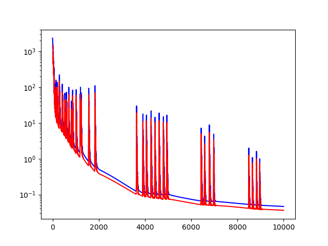 | Train loss 4.65e-02 +/- 2.16e-03<br/>Test loss 3.63e-02 +/- 5.82e-03 |
| Light Baseline | 6375 | 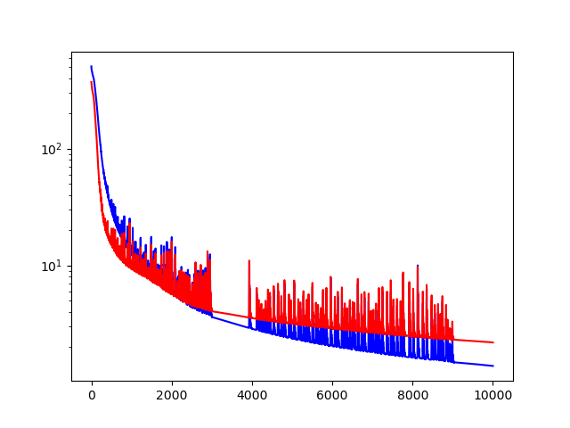 | Train loss 1.90e+00 +/- 1.37e-01<br/>Test loss 3.57e+00 +/- 2.96e-01 |
| Light HNN | 6225 | 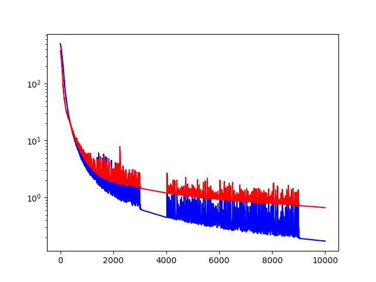 | Train loss 2.67e-01 +/- 1.22e-02<br/>Test loss 1.25e+00 +/- 2.12e-01 |
| Light LNN | 6150 | 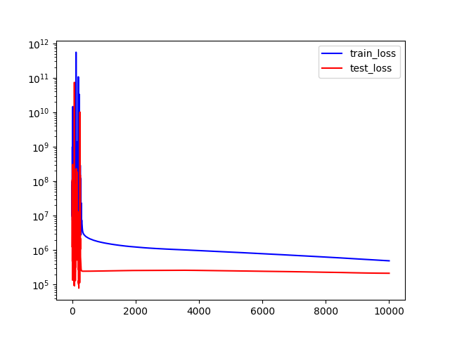 | Train loss 4.92e+05 +/- 1.14e+05<br/>Test loss 2.14e+05 +/- 9.27e+04 |
| Baseline | 42000                | 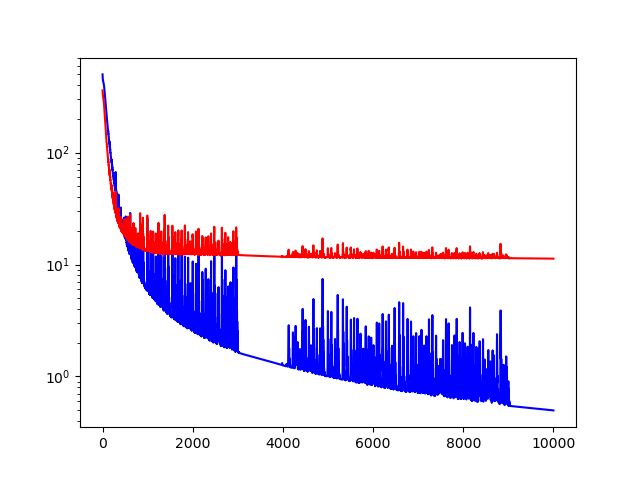 | Train loss 5.03e-01 +/- 6.24e-02<br/>Test loss 2.20e+01 +/- 1.74e+00 |
| HNN      | 41600                | 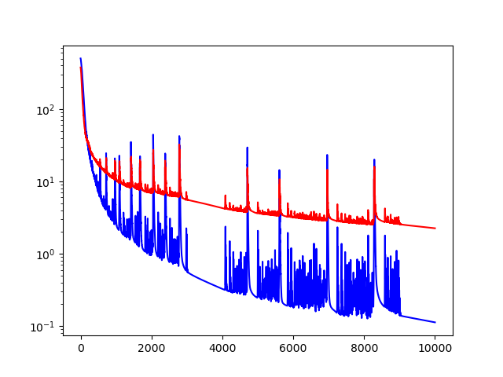 | Ttrain loss 1.13e-01 +/- 3.61e-03<br/>Test loss 4.35e+00 +/- 6.97e-01 |
| LNN      | 364200               | 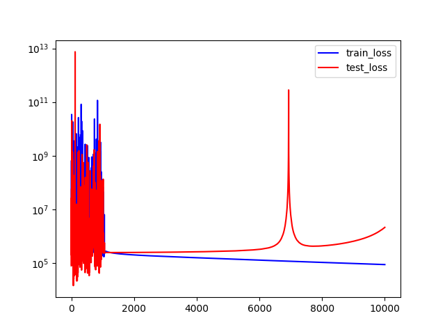 | Train loss 8.80e+04 +/- 3.46e+04<br/>Test loss 2.14e+06 +/- 2.63e+06 |

- Task 2: Three-body systems: 

| Network        | Number of parameters | Training Figure                                         | Loss                                                         |
| -------------- | -------------------- | ------------------------------------------------------- | ------------------------------------------------------------ |
| ModLaNet       | 5603                 | 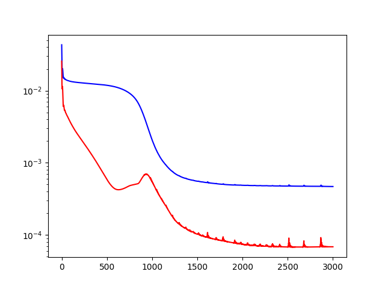 | Train loss 4.69e-04 +/- 2.72e-04 <br/>Test loss 6.85e-05 +/- 8.20e-06 |
| Light Baseline | 6720                 | 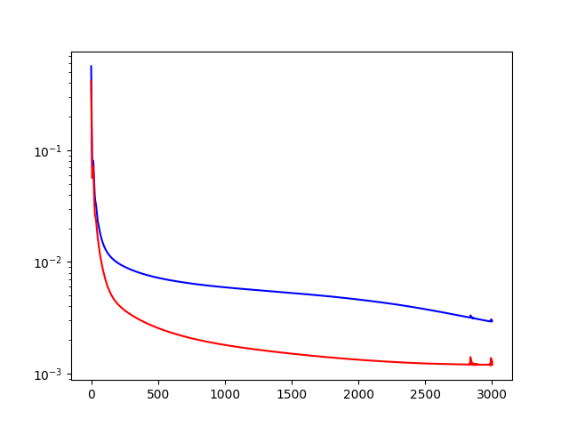 | Train loss 5.60e-03 +/- 2.86e-03 <br/>Test loss 2.11e-03 +/- 2.34e-04 |
| Light HNN      | 6020                 | 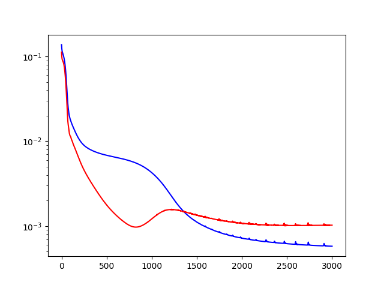 | Train loss 7.86e-04 +/- 2.93e-04 <br/>Test loss 1.63e-03 +/- 2.27e-04 |
| Light LNN      | 5950                 | 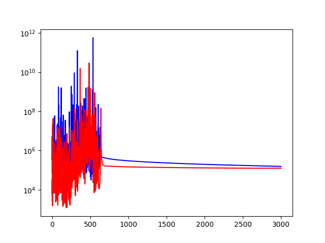 | Train loss 1.56e+05 +/- 9.68e+04 <br/>Test loss 1.26e+05 +/- 1.41e+05 |
| Baseline       | 45200                | 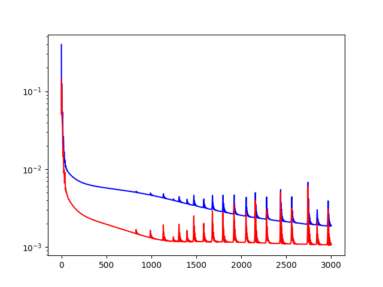 | Train loss 3.66e-03 +/- 1.78e-03 <br/>Test loss 2.07e-03 +/- 2.00e-04 |
| HNN            | 43200                | 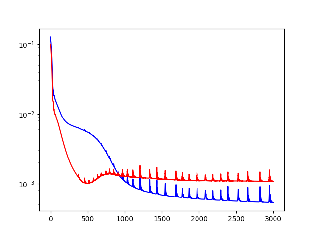 | Train loss 7.28e-04 +/- 2.95e-04 <br/>Test loss 1.80e-03 +/- 2.40e-04 |
| LNN            | 369000               | 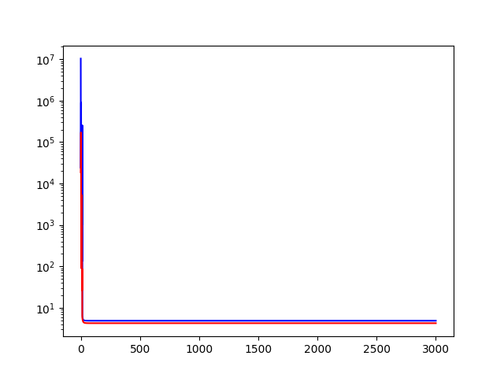 | Train loss 4.87e+00 +/- 5.10e-02 <br/>Test loss 4.25e+00 +/- 1.46e-01 |


### Part 2: Prediction

In the second part, we make a multiple-step prediction to examine the performance within a continuous period, which is different from training. Since errors will accumulate over time to affect simulation results, it is better to examine the stability and robustness of trained models.

To analyze results:

 * `./analysis/analyze-pend-2.ipynb`: It will compare three models (ModLaNet, HNN, and baseline) in simulating the double-pendulum system.
 * `./analysis/analyze-body-3.ipynb`: It will compare three models (ModLaNet, HNN, and baseline) in simulating the three-body system.

|                                  | ModLaNet                                             | LNN               | HNN                                         | Baseline                                    |
| -------------------------------- | ---------------------------------------------------- | ----------------- | ------------------------------------------- | ------------------------------------------- |
| Case 1: MSE_q | **1.27e0 +/- 1.06e0** | FAILED | 2.73e0  +/- 2.15e0 | 2.73e0  +/- 2.15e0 |
| Case 1: MSE_E | **2.65e-2 +/- 3.10e-2** | FAILED | 7.60e0 +/- 3.95e2 | 1.33e+3 +/- 4.09e+3 |
| Case 2: MSE_q | **2.85e-2 +/- 1.88e-2** | FAILED | 1.53e-1 +/- 9.71e-2 | 4.45e-1 +/- 2.12e-1 |
| Case 2: MSE_E | **1.95e-3 +/- 6.22e-3** | FAILED | 6.52e-2 +/- 2.79e-1 | 3.14e-1 +/- 3.65e-1 |

| Experiments                      | Results                                                      |
| -------------------------------- | ------------------------------------------------------------ |
| Case 1: MSE_q | 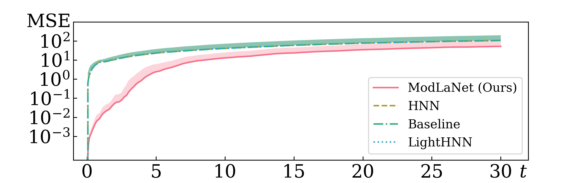 |
| Case 1: MSE_E | 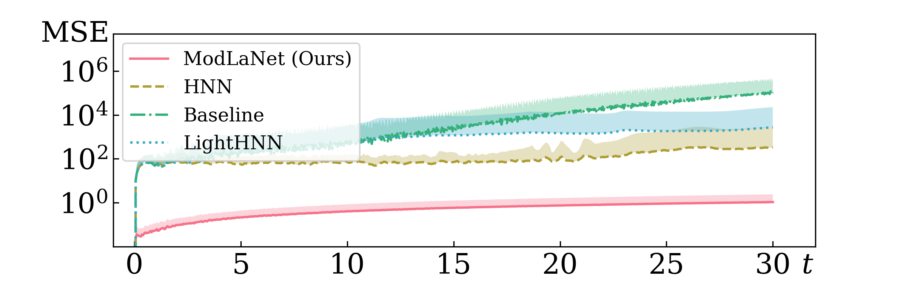 |
| Case 2: MSE_q | 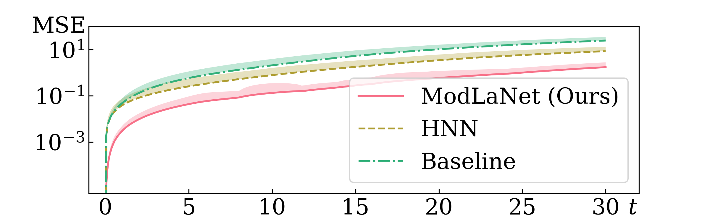 |
| Case 2: MSE_E | 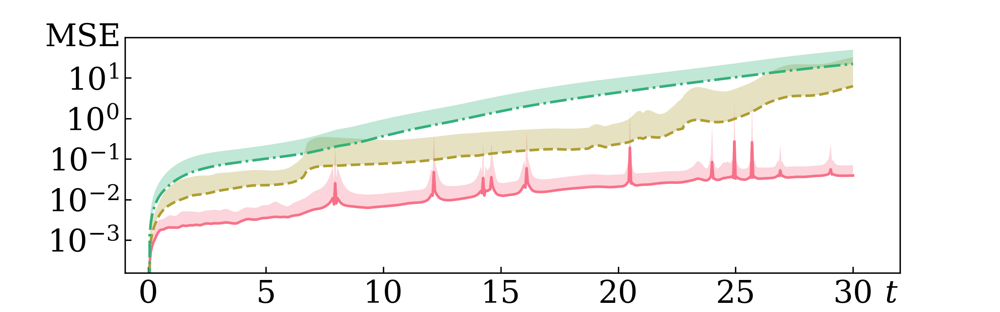 |


### Part 3: Extension

#### 1. Settings

The third part examines the performance of our framework in extension. The procedure is the same as the last part but has complex cases: multiple-pendulum and multiple-object systems. The initial states are chosen randomly, and the prediction progress is repeated 100 times for average and variance. Prediction time $t_h$ is 10s. 

We evaluate our framework using two strategies: 1. We directly extend the trained framework to construct target systems and make predictions during a range of time. 2. Before extensions, we utilise minor datasets of multiple-pendulum or multiple-body systems to retrain the models for fine-tuning, similar to transfer learning. The size of the datasets is only $1/10$ of those used in the training part. And the retraining epoch is decreased to $1/3-1/5$.

Setting is as follows:

- Case 1: Multi-pendulum systems: 

| Network            | Execution                                                    |
| ------------------ | ------------------------------------------------------------ |
| Strategy 1         | `python ./experiment-pend-2+/train.py --model 'modlanet' --learn_rate 1e-2 --end_epoch 10000 --overwrite --verbose --plot` |
| Retrain for 3-pend | `python ./experiment-pend-2+/train.py --model 'modlanet' --learn_rate 1e-2 --load_epoch 10000 --end_epoch 12000 --sample 20 --overwrite --verbose --plot --start_obj 2 --obj 3` |
| Retrain for 4-pend | `python ./experiment-pend-2+/train.py --model 'modlanet' --learn_rate 1e-2 --load_epoch 10000 --end_epoch 12000 --sample 20 --overwrite --verbose --plot --start_obj 2 --obj 4	` |

- Case 2: Three-body systems: 

| Network            | Execution                                                    |
| ------------------ | ------------------------------------------------------------ |
| Strategy 1         | `python ./experiment-body-3+/train.py --model 'modlanet' --learn_rate 1e-3 --end_epoch 3000 --overwrite --verbose --plot` |
| Retrain for 4-body | `python ./experiment-body-3+/train.py --model 'modlanet' --learn_rate 1e-3 --load_epoch 3000 --end_epoch 4000 --sample 20 --overwrite --verbose --plot --start_obj 3 --obj 4` |
| Retrain for 5-body | `python ./experiment-body-3+/train.py --model 'modlanet' --learn_rate 1e-3 --load_epoch 3000 --end_epoch 3600 --sample 20 --overwrite --verbose --plot --start_obj 3 --obj 4 ` |
| Retrain for 6-body | `python ./experiment-body-3+/train.py --model 'modlanet' --learn_rate 1e-3 --load_epoch 3000 --end_epoch 4000 --sample 20 --overwrite --verbose --plot --start_obj 3 --obj 5 ` |


#### 2. Results

* `./analysis/analyze-pend-2+.ipynb`: It will reveal the extrapolation feature of ModLaNet in multi-pendulum systems. The number of the connected pendulums can be set by user.
* `./analysis/analyze-body-3+.ipynb`: It will reveal the extrapolation feature of ModLaNet in multi-body systems. The number of the bodies can be set by user.

| Cases  | Results (In each subfigure, left: strategy 1 without retrain; right: strategy 2 with retrain) |
| ------ | ------------------------------------------------------------ |
| Case 1 | 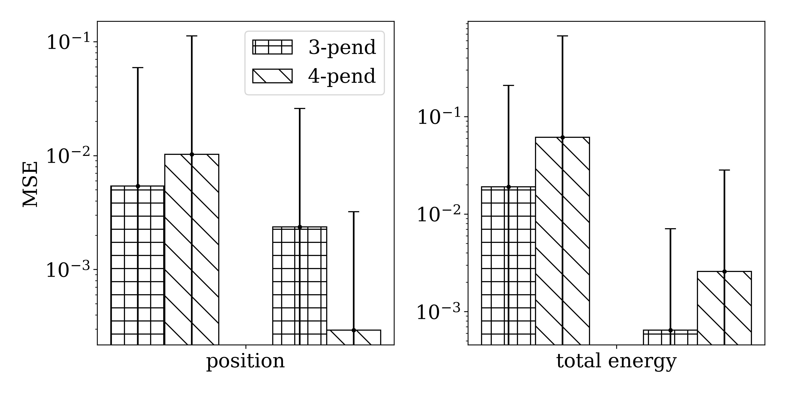       |
| Case 2 | 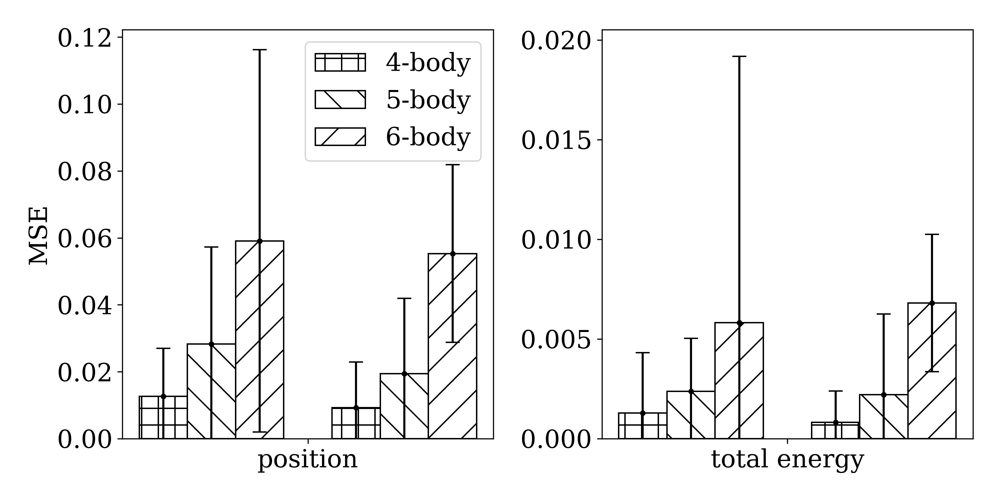       |


## Dependencies

Here we list all packages we used to build this project.

For ModLaNet, HNN, Baseline:

- NumPy (1.19.2)
- PyTorch (1.7.1)
- Matplotlib (3.3.2)
- Scipy (1.6.0)

For LNN, we conducted our experiment based on the original obtained from [lagrangian_nns](https://github.com/MilesCranmer/lagrangian_nns)). But we also implement it using PyTorch:

 * Jax (Best with Nvidia GPU for computation acceleration)
 * NumPy
 * MoviePy (visualization)
 * celluloid (visualization)

This project is written in Python 3.7.


## Acknowledgment

This project is built based on [hamiltonian-nn](https://github.com/greydanus/hamiltonian-nn).


